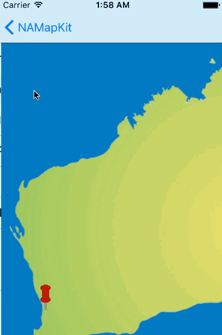
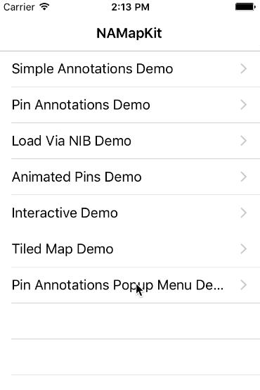

NAMapKit
========

[](https://travis-ci.org/neilang/NAMapKit)

Lets you drop pins or custom annotations onto a standard `UIImage` or a tiled `NATiledImageView`. Includes callouts, multi-colored pins, animation, zoom and gestures support.



Get started by running `pod try NAMapKit` in your terminal.

Usage
-----

#### Default Annotations

Create a `NAMapView` in a view controller.

``` objc
NAMapView *mapView = [[NAMapView alloc] initWithFrame:self.view.bounds];

mapView.backgroundColor  = [UIColor colorWithRed:0.000f green:0.475f blue:0.761f alpha:1.000f];
mapView.autoresizingMask = UIViewAutoresizingFlexibleWidth | UIViewAutoresizingFlexibleHeight;

mapView.minimumZoomScale = 0.5f;
mapView.maximumZoomScale = 1.5f;

[mapView displayMap:[UIImage imageNamed:@"australia"]];

[self.view addSubview:mapView];
```

Add `NADotAnnotation` annotations.

```
NADotAnnotation *dot = [NADotAnnotation annotationWithPoint:CGPointMake(543.0f, 489.0f)];
[mapView addAnnotation:dot animated:NO];
```

#### Custom Annotations

The implementation of `NADotAnnotation` places a red semi-transparent dot on the map. For custom annotations, subclass [NAAnnotation](NAMapKit/NAAnnotation.h) and implement `createViewOnMapView` that returns a custom annotation view. You could also implement a custom animation to drop an annotation onto the map by implementing `addToMapView`, or center the annotation depending on your custom logic by overriding `updatePosition`.

You can find a complete custom annotation example of multi-colored pins in [NAPinAnnotation.h](NAMapKit/NAPinAnnotation.h)/[.m](NAMapKit/NAPinAnnotation.m) and a popup menu demo in [NAPinAnnotationsPopupMenuDemoViewController.h](Demo/Demo/NAPinAnnotationsPopupMenuDemoViewController.h)/[.m](Demo/Demo/NAPinAnnotationsPopupMenuDemoViewController.m).



#### Delegates

You can capture finger taps and zoom changes by registering a `mapViewDelegate` with the map. The delegate must implement the [NAMapViewDelegate](NAMapKit/NAMapViewDelegate.h) protocol.

```objc
@implementation DemoViewController

- (void)viewDidLoad
{
    // Register the view controller as the map's delegate
    self.mapView.mapViewDelegate = self;
}

- (void)mapView:(NAMapView *)mapView tappedOnAnnotation:(NAPinAnnotation *)annotation
{
    // Invoked when a user taps an annotation
}

- (void)mapView:(NAMapView *)mapView hasChangedZoomLevel:(CGFloat)level
{
    // Invoked when the map zoom level changes
}

@end
```

See [NAAnnotationDemoViewController.m](Demo/Demo/NAAnnotationDemoViewController.m) for a complete example.

#### Tiled Maps

NAMapKit comes with [NATiledImageMapView](NAMapKit/NATiledImageMapView.h), which supports tiled maps. A typical organization for deep zoom map tiles consists of a folder for each zoom level and individual JPG files for each tile. You can see an example of such files [here](Demo/Maps/Armory2014/tiles). NAMapKit uses [ARTiledImageView](https://github.com/dblock/ARTiledImageView). You can generate tiles using [dzt](https://github.com/dblock/dzt) or any other tool listed with the [OpenSeadragon](http://openseadragon.github.io/examples/creating-zooming-images) project.

For a complete example of a tiled map, see [NATiledImageDemoViewController.m](Demo/Demo/NATiledImageDemoViewController.m).

### Custom Gestures

NAMapKit exposes it's two double tap gestures so that you can use `delaysTouchesBegan` to prioritise the double tap over a map point tap. Or to just replace them entirely yourself.

Notes
-----

If you are using Interface Builder, you can add a UIScrollView to your XIB and change the class to `NAMapView` to use the framework.

License
-------

This project is licensed under the [MIT license](LICENSE).

Attribution
-----------

When using this code please include the following attribution:

**Includes NAMapKit code developed by [Neil Ang](http://neilang.com/), [Tony Arnold](http://thecocoabots.com/), [Daniel Doubrovkine](http://code.dblock.org/) and [Orta Therox](http://orta.github.io/).**
