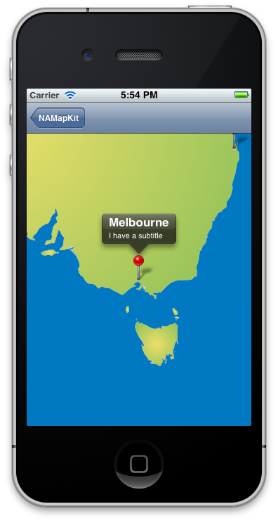
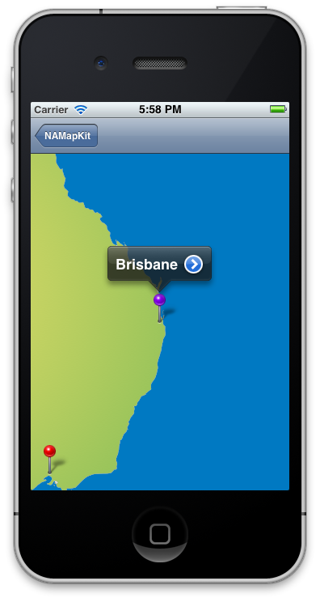

NAMapKit
========

Lets you drop MapKit style pins onto a standard UIImage - _also includes callouts, multi-colored pins, animation, zoom and gestures_.

Usage
------

Current version _requires ARC and iOS5_ (untested on iOS4). If you are developing for iOS3/4, checkout the version 1.0 tag of the repository.

Example code on how to use this framework can be found in the demo app. 

If you are using Interface Builder, you can add a UIScrollView to your XIB and change the class to "NAMapView" to use the framework.

Attribution
-----------

When using this code please include the following attribution:

**Includes NAMapKit code developed by [Neil Ang](http://neilang.com/) and [Tony Arnold](http://thecocoabots.com/).**

Have an app on the AppStore that's using NAMapKit? [Add it to our showcase](https://github.com/neilang/NAMapKit/wiki/Apps-using-NAMapKit).

